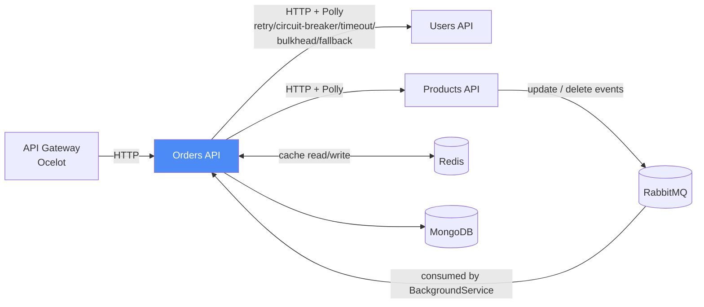

# Orders Microservice — `orders-api`

The orchestration hub of the **eCommerce Microservices** system. Creates and manages orders by pulling live data from the Users and Products services, and is the service with the heaviest resilience/caching investment in the whole system.

Part of a 5-repository microservices system. See the [organization](https://github.com/ym-harsha-ecommerce-microservices) for the full picture, or jump to the [API Gateway](https://github.com/ym-harsha-ecommerce-microservices/api-gateway) and [infrastructure](https://github.com/ym-harsha-ecommerce-microservices/ecommerce-infrastructure) repos.

     

## Where it fits



This is the only service in the system that both **calls out** to its peers over HTTP (Users, Products) and **listens** for their events over RabbitMQ — everything else is either a pure data owner or a pure gateway.

## Tech stack

| Concern | Choice |
|---|---|
| Runtime | ASP.NET Core Web API (.NET 10) |
| Data access | MongoDB.Driver (no ORM — this service owns a document store) |
| Database | MongoDB |
| Inter-service calls | Typed `HttpClient`s wrapped in Polly resilience policies |
| Fault tolerance | **Polly**: retry, circuit breaker, timeout, bulkhead isolation, fallback |
| Caching | Redis (`IDistributedCache`), read-through with dummy-data fallback |
| Messaging | RabbitMQ consumer via `BackgroundService` |
| Validation | FluentValidation, auto-invoked by a custom `IAsyncActionFilter` |
| Testing | xUnit, Moq, AutoFixture (AutoMoq), FluentAssertions |

## Architecture

```
eCommerce.BLL/
├── DTO/Order, DTO/OrderItem/          # OrderAddRequest, OrderUpdateRequest, OrderResponse...
├── Exceptions/                         # BadRequestException, NotFoundException
├── HttpClients/                         # UsersMicroserviceHttpClient, ProductsMicroserviceHttpClient
├── Policies/                             # IPolicyService/PolicyService, per-microservice policy wrappers
├── RabbitMQ/                              # RabbitMQConsumer, RabbitMQPublisher, RabbitMQOptions
├── BackgroundServices/                     # RabbitMQBackgroundService
├── Services/Contracts/                      # IOrdersService
├── Services/Implementations/                 # OrderService
└── Validators/                                 # OrderAddRequestValidator, OrderUpdateRequestValidator, OrderItem*Validator

eCommerce.DAL/
├── Entities/                            # Order, OrderItem
└── Repositories/                          # IOrderRepository, OrderRepository (MongoDB.Driver)

eCommerce.API/
├── Contollers/                          # OrdersController
├── Middlewares/                          # GlobalExceptionHandlingMiddleware
└── Filters/                               # GlobalValidationFilter
```

**Notable implementation choices:**

- **Custom automatic-validation pipeline instead of CQRS.** Rather than adopting MediatR/CQRS (which the course doesn't use either), validation runs through a hand-written `GlobalValidationFilter : IAsyncActionFilter` — it reflects over every action argument, looks up a registered `IValidator<T>` for its type, runs it, and short-circuits with `400 Bad Request` if anything fails. Controllers stay free of manual `ModelState`/validator-calling boilerplate.
- **Fault tolerance is config-driven, not hardcoded.** `PolicyService` builds the actual Polly policies (retry with exponential backoff, circuit breaker, timeout, bulkhead, fallback), but the *numbers* — retry count, breaking threshold, timeout seconds — are read from `IConfiguration` (backed by Docker/Kubernetes environment variables) through small per-target wrappers (`ProductsMicroservicePolicies`, `UsersMicroservicePolicies`), each exposed behind its own interface. Tuning resilience for Products vs. Users doesn't require a code change.
- **Redis as a resilience layer, not just a speed-up.** `ProductsMicroserviceHttpClient`/`UsersMicroserviceHttpClient` check Redis first; on a cache miss they call the peer service, and on a `503` from that service they fall back to a clearly-marked dummy record (`"Temporarily Unavailable"`) instead of failing the whole order. A live product/user response is cached with a short absolute + sliding expiration afterward.
- **`BackgroundService`, not `IHostedService` directly.** The course implements the RabbitMQ consumer as a raw `IHostedService`; here it's a `BackgroundService` subclass, which gives cleaner long-running-task semantics (cancellation via `stoppingToken`, automatic retry-with-delay loop if RabbitMQ isn't reachable yet on startup) for what is fundamentally a long-lived loop.
- **A layered exception→HTTP-status mapping.** `GlobalExceptionHandlingMiddleware` distinguishes `BadRequestException` (400), `NotFoundException` (404), MongoDB duplicate-key errors (409), other `MongoException`s (503), downstream `HttpRequestException`s (502 — a dependent microservice is down), and everything else (500) — so a MongoDB hiccup and a genuinely-missing order don't look the same to a client.

## API Endpoints

| Method | Route | Description |
|---|---|---|
| `GET` | `/api/orders` | Get all orders |
| `GET` | `/api/orders/search/orderid/{orderID}` | Get a single order |
| `GET` | `/api/orders/search/productid/{productID}` | Orders containing a given product |
| `GET` | `/api/orders/search/orderDate/{orderDate}` | Orders placed on a given date |
| `GET` | `/api/orders/search/userid/{userID}` | Orders placed by a given user |
| `POST` | `/api/orders` | Create an order (validates user + all products exist first) |
| `PUT` | `/api/orders/{orderID}` | Update an order |
| `DELETE` | `/api/orders/{orderID}` | Delete an order |

## Running locally

```bash
docker build -t orders-api .
docker run -p 8082:8080 --env-file .env orders-api
```

Needs MongoDB, Redis, and RabbitMQ reachable, plus the Users and Products APIs for a fully functional order flow — all wired up in [`ecommerce-infrastructure`](https://github.com/ym-harsha-ecommerce-microservices/ecommerce-infrastructure)'s Docker/Kubernetes setup.

## Testing

```bash
dotnet test eCommerceSolution.OrdersService.slnx
```

This service carries the largest test suite in the system — xUnit + Moq + AutoFixture (AutoMoq) + FluentAssertions throughout:

| Test class | What it covers |
|---|---|
| `OrderServiceTest` | Full CRUD flow, including totals recalculation, the user/product-existence checks, and every branch of `UpdateOrderAsync` (not found, ownership mismatch, repository failure) |
| `DistributedCacheServiceTest` | Cache hit/miss, bulk get, and that a Redis outage degrades gracefully instead of throwing |
| `PolicyServiceTest` | The *actual* Polly policies executed against fake delegates — real retry counts, real circuit-breaker trips, real timeouts, real bulkhead rejection, not mocked-out Polly internals |
| `ProductsMicroserviceHttpClientTest` / `UsersMicroserviceHttpClientTest` | Cache-first behavior, the 503-triggers-dummy-fallback path, and partial-cache-hit batch fetching, using a fake `HttpMessageHandler` instead of a real network call |
| `RabbitMQBackgroundServiceTest` | The consumer registration lifecycle via real `StartAsync`/`StopAsync`, correct queue/routing-key wiring, and cleanup on shutdown |

## CI/CD

```yaml
# .github/workflows/orders-ci.yml (abridged)
- run: dotnet restore eCommerceSolution.OrdersService.slnx
- run: dotnet build eCommerceSolution.OrdersService.slnx --no-restore
- run: dotnet test eCommerceSolution.OrdersService.slnx --no-build --verbosity normal
- uses: docker/build-push-action@v5   # → ghcr.io/.../ecommerce-orders-api:latest + :v1.<run_number>
```

On success, a second workflow (triggered via `workflow_run`) runs on the **self-hosted runner** and deploys straight to the local Kubernetes cluster:

```yaml
kubectl set image deployment/orders-api-deployment orders-api=ghcr.io/.../ecommerce-orders-api:latest -n ecommerce-infrastructure
kubectl rollout restart deployment/orders-api-deployment -n ecommerce-infrastructure
```

Full pipeline design (and the reasoning behind self-hosting it) lives in the [infrastructure repo](https://github.com/ym-harsha-ecommerce-microservices/ecommerce-infrastructure).

## Origin & Certification

Built while working through Harsha Vardhan's [.NET Microservices with Azure DevOps & AKS](https://www.udemy.com/course/dot-net-microservices-ecommerce-project-azure-devops-kubernetes-aks/) course, then taken further: the course covers RabbitMQ, Polly, and Redis individually, but the config-driven policy wrappers, the dummy-fallback caching strategy, and the `BackgroundService`-based consumer are this repo's own additions on top of that foundation.

🎓 **Certificate:** [Certificate link](https://drive.google.com/file/d/1VVxsmjJU57NlZn8QpqDcRlLGiE5nztiJ/view?usp=drive_link)
